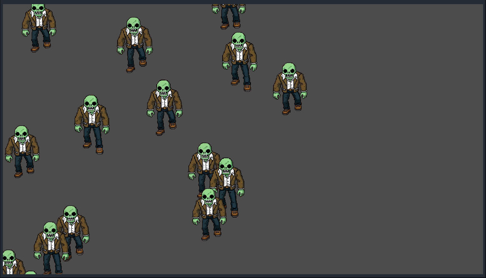

# Godot 2D 僵尸下落与生成示例



本项目演示了如何在 Godot 4.x 中实现以下功能：
*   动态生成角色（僵尸）。
*   控制角色动画和移动。
*   当角色移出屏幕时自动销毁。
*   使用 Node2D 的 Y-Sort 功能实现正确的 2D 渲染遮挡。

## 项目结构与核心组件

### 1. 主场景 (`node_2d.tscn` 和 `node_2d.gd`)

*   **`node_2d.tscn`**: 游戏的主场景。
    *   根节点是一个 `Node2D`，附加了 `node_2d.gd` 脚本。
    *   包含一个名为 `ZombieContainer` 的子 `Node2D` 节点。这个 `ZombieContainer` 节点启用了 `YSort Enabled` 属性，用于确保在其内部的僵尸能够根据 Y 坐标正确排序渲染，实现近处物体遮挡远处物体的效果。

*   **`node_2d.gd`**: 主场景脚本，负责管理僵尸的生成。
    *   **预加载僵尸场景**: 
        ```gdscript
        @export var zombie_scene: PackedScene = preload("res://zombie_character.tscn")
        ```
        使用 `@export` 导出一个 `PackedScene` 类型的变量 `zombie_scene`，并预加载 `zombie_character.tscn` 作为僵尸的模板。
    *   **生成参数**:
        ```gdscript
        @export var spawn_interval: float = 2.0  # 每隔多少秒生成一个僵尸
        @export var spawn_area_width: float = 800.0 # 僵尸生成的水平范围
        ```
        允许在编辑器中调整僵尸的生成间隔和生成位置的水平宽度。
    *   **获取 `ZombieContainer`**:
        ```gdscript
        @onready var zombie_container: Node2D = $ZombieContainer
        ```
        在节点准备就绪时，获取对 `ZombieContainer` 子节点的引用。
    *   **生成逻辑 (`spawn_zombie` function)**:
        *   定时（由 `spawn_interval` 控制）调用此函数。
        *   实例化 `zombie_scene` (`new_zombie = zombie_scene.instantiate()`)。
        *   随机计算新僵尸的初始 X 坐标（在 `spawn_area_width` 范围内）和固定的初始 Y 坐标（屏幕顶端稍外侧，如 -50）。
        *   设置新僵尸的 `global_position`。
        *   给新僵尸一个唯一的名字，方便调试 (`new_zombie.name = "Zombie_" + str(Time.get_ticks_msec())`)。
        *   将新僵尸作为子节点添加到 `zombie_container` 中 (`zombie_container.add_child(new_zombie)`)，以便进行 Y 排序。

### 2. 僵尸角色场景 (`zombie_character.tscn` 和 `zombie.gd`)

*   **`zombie_character.tscn`**: 单个僵尸的场景模板。
    *   根节点是一个 `AnimatedSprite2D`，用于显示僵尸的动画。
        *   其 `SpriteFrames` 资源配置了僵尸的行走动画（例如，名为 "default" 的动画），使用了 `anim/zombie/` 目录下的 `zombie_0X.png` 图片序列。
        *   `Autoplay` 属性应设置为 "default" 或在脚本中启动。
    *   该场景的根节点附加了 `zombie.gd` 脚本。

*   **`zombie.gd`**: 控制单个僵尸行为的脚本。
    *   **移动速度**:
        ```gdscript
        @export var move_speed: float = 25.0
        ```
        允许在编辑器中或在 `zombie_character.tscn` 场景中为僵尸类型调整移动速度。
    *   **自动播放动画 (`_ready` function)**:
        ```gdscript
        func _ready():
            if not is_playing():
                play("default") 
        ```
        确保僵尸生成时自动播放名为 "default" 的动画。
    *   **向下移动 (`_process` function)**:
        ```gdscript
        position.y += move_speed * delta
        ```
        每帧更新僵尸的 Y 坐标，使其向下移动。
    *   **移出屏幕后销毁 (`_process` function)**:
        *   获取屏幕高度 (`get_viewport_rect().size.y`)。
        *   获取当前僵尸帧的纹理高度 (`sprite_frames.get_frame_texture(animation, frame).get_height() * scale.y`)。
        *   判断僵尸是否完全移出屏幕底部。如果其 `global_position.y` 减去自身高度的一半大于屏幕高度，则调用 `queue_free()` 将其从场景中移除并释放内存。

### 3. 资源 (`anim/zombie/`)

*   包含僵尸动画所需的 PNG 图片序列 (例如, `zombie_00.png` 到 `zombie_05.png`)。
*   每个图片都有一个对应的 `.import` 文件，这是 Godot 管理资源导入设置的方式。

## 关键技术点

*   **场景实例化 (`PackedScene.instantiate()`)**: 用于根据模板场景 (`zombie_character.tscn`) 创建新的僵尸实例。
*   **`@export` 注解**: 用于将变量暴露到 Godot 编辑器的检查器中，方便调整参数而无需修改代码。
*   **`@onready` 注解**: 用于确保在访问子节点之前，该子节点已经准备就绪。
*   **信号与自定义方法**: 虽然本项目未使用自定义信号，但这是 Godot 中节点间通信的常用方式。
*   **`_process(delta)`**: 每帧调用的函数，用于处理动态行为，如移动和状态检查。
*   **`_ready()`**: 当节点及其所有子节点进入场景树时调用的函数，用于初始化。
*   **`queue_free()`**: 安全地从场景树中移除节点并释放其占用的内存。
*   **`AnimatedSprite2D` 和 `SpriteFrames`**: Godot 中实现 2D 帧动画的核心组件。
*   **`Node2D.y_sort_enabled`**: Godot 4.x 中用于启用基于 Y 坐标的子节点渲染排序，以实现正确的 2D 深度感。子节点会根据其原点 (pivot point) 的 Y 值进行排序。

## 如何运行

1.  确保您已安装 Godot Engine (建议 4.x 版本)。
2.  下载或克隆本项目。
3.  在 Godot 项目管理器中，选择 "导入" (Import)。
4.  浏览到项目文件夹，并选择 `project.godot` 文件。
5.  导入项目后，在编辑器中打开 `node_2d.tscn`。
6.  点击编辑器右上角的 "运行场景" (F6) 按钮。

## 配置

*   **僵尸生成速度和范围**: 在 `node_2d.tscn` 场景中选中根 `Node2D` 节点，然后在检查器中调整 `Spawn Interval` 和 `Spawn Area Width` 属性。
*   **僵尸移动速度**:
    *   可以在 `zombie_character.tscn` 场景中选中根 `AnimatedSprite2D` 节点，然后在检查器中调整其脚本变量 `Move Speed`。
    *   或者直接修改 `zombie.gd` 脚本中 `move_speed` 变量的默认值。

---

希望这份文档能帮助您理解这个项目的实现细节！ 